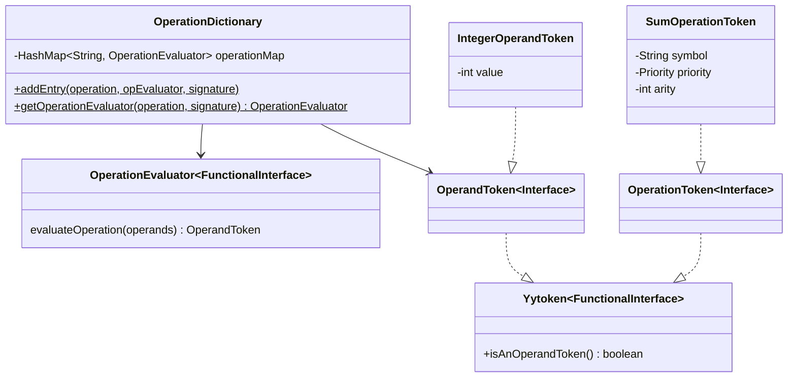
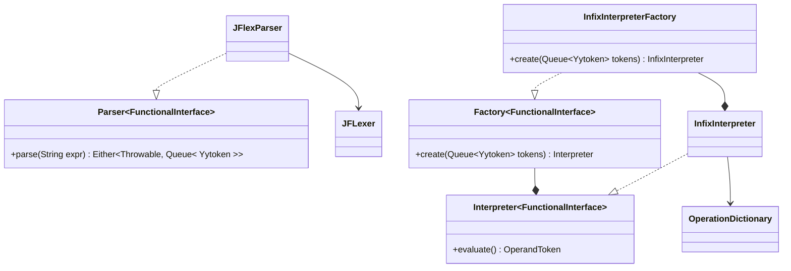
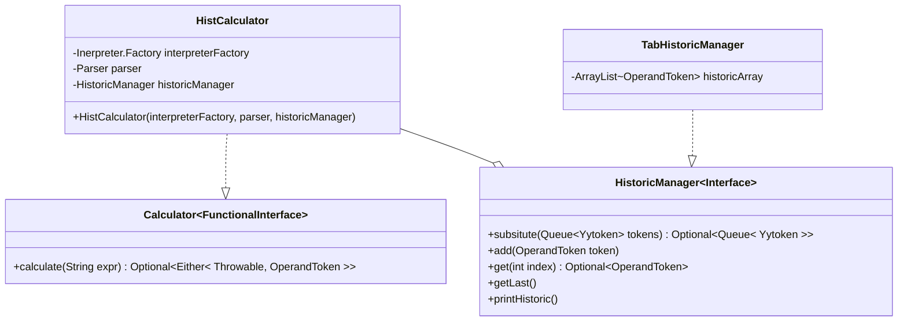

# Paleo 🐘

Une calculatrice évolutive écrite en Java.

<!-- vim-markdown-toc GFM -->

* [Compilation et exécution 🛠](#compilation-et-exécution-)
   * [Dépendances](#dépendances)
   * [Docker](#docker)
   * [Compilation](#compilation)
   * [Exécution](#exécution)
* [Utilisation 💻](#utilisation-)
* [Fonctionnalités 🗂](#fonctionnalités-)
   * [Extensions implémentées](#extensions-implémentées)
      * [Extension 1 : calculatrice multi-type](#extension-1--calculatrice-multi-type)
         * [Design](#design)
      * [Extension 2 : syntaxe algébrique traditionnelle](#extension-2--syntaxe-algébrique-traditionnelle)
         * [Design](#design-1)
            * [Le *parser*](#le-parser)
            * [L'interpréteur](#linterpréteur)
      * [Extension 3 : rappel de valeurs](#extension-3--rappel-de-valeurs)
         * [Design](#design-2)
   * [Architecture](#architecture)
* [Organisation 📊](#organisation-)
   * [Répartition des tâches](#répartition-des-tâches)
* [Coordonnées  🧑‍💻](#coordonnées--)

<!-- vim-markdown-toc -->

## Compilation et exécution 🛠

### Dépendances

* `maven` >= 4.0
* `make`

### Docker

Une [image Docker](https://hub.docker.com/repository/docker/emilerolley/maven)
utilisée pour le `runner` de `GitLab-CI` peut-être utilisée :

```zsh
docker pull emilerolley/maven
docker run -ti emilerolley/maven
cd paleo
git pull
```

### Compilation

Pour compiler le projet :

```shell
make
```

Pour générer la documentation :

```zsh
make doc
```

> La documentation se trouvera alors dans *./paleo-<lib/demo>/target/site*.
>
> La documentation de `paleolib` sera certainement celle que vous voudrez consulter.

Pour nettoyer le projet :

```zsh
make clean
```

### Exécution

Pour exécuter le programme :

```zsh
make run
```

ou

```zsh
java -jar paleo-demo.jar
```

## Utilisation 💻

Après avoir lancé le programme, vous pouvez évaluer n'importe quelle expression écrite
avec une syntaxe algébrique (notation infixe).

```
> 10 * (5.2 + 3)  <-- Expression en notation infixe.
(1) : 82.0        <-- Résultat de l'expression après évaluation.
 ^------------------- Indice dans l'historique.
> false or not true
(2) : false

> ls              <-- Affiche l'historique sous forme de tableau.
+-----------+
| 2 : false | <------ Valeurs correspondantes aux précédents résultats.
| 1 : 82.0  | <-----/
+-----------+
| 0 : false | <------ Valeur du dernier calcul.
-------------

> hist(1)         <-- Permet de récupérer la valeur à l'indice 1 de l'historique
                      et de l'utiliser comme opérande.
(3) : 82.0

```

> Ces informations peuvent être retrouvée grâce à la commande `help`.

## Fonctionnalités 🗂

### Extensions implémentées

#### Extension 1 : calculatrice multi-type

Son implémentation ajoute les types suivants :

* Les **entiers** et **réels** avec les opérations usuelles `* / - +`.
* Les **booléens** `false` et `true` avec les opérations `or and not`.
* Les **ensembles** contenant des éléments des types précédents avec les opérations
`inter union diff`.

##### Design



Chacune des implémentations de l'interface `OperandToken` correspondes à un
*type* d'opérande et s'occupent d'ajouter les implémentation de
`OperationEvaluator` correspondants aux opérations supportées par ce type dans
la `HashMap` statique de `OperationDictionary` grâce à la méthode
`OperationDictionary::addEntry` qui en assure l'unicité.

Par exemple l'ajout de l'addition entre deux entiers ce fait de la façons
suivante :

```java
OperationDictionary.addEntry(
  new SumOperationToken(),
  operands -> {
    return
      new IntegerOperandToken(
         ((IntegerOperandToken) operands.pop()).getValue() +
         ((IntegerOperandToken) operands.pop()).getValue()
      );
   },
   List.of(IntegerOperandToken.class, IntegerOperandToken.class)
);

```

Ainsi, l'ajout de nouveau type d'opérande se fait **facilement** et **indépendamment**
du reste de l'implémentation du programme.

#### Extension 2 : syntaxe algébrique traditionnelle

Dès la première version nous avons voulu implémenter la gestion de la syntaxe algébrique,
en effet, elle nous parait plus ergonomique que la syntaxe RPN.

##### Design



###### Le *parser*

Pour *parser* une expression nous avons choisis d'utiliser [JFLex](https://jflex.de/),
ce qui nous a permis d'avoir un *lexer* facilement incrémentable et robuste.
Par exemple toutes ces expressions produisent la même liste de *tokens* :

```
> 5 - (-5)
> 5--5

> {1; false; true}
> {1,false,true}
> { 1 false true }
> { 1 false true true 1 }

> true or (not false)
> trueornotfalse
```

Depuis le fichier *./paleo-lib/src/main/jflex/jflexer.jflex* et générer la
classe `paleo.lib.parser.JFLexer` utilisée par `paleo.lib.parser.JFlexParser`
pour générer une liste de `Yytoken` correspondants à l'expression en syntaxe algébrique.

###### L'interpréteur

Cette liste est ensuite évaluée grâce à une instance de `InfixInterpreter`.
Pour cela un [algorithme](https://algorithms.tutorialhorizon.com/evaluation-of-infix-expressions/)
utilisant deux piles (une d'opérandes et l'autre d'opérations) est utilisé.

Grâce aux interfaces `Parser` et `Interpreter` il est tout à fait possible d'**ajouter**
des interpréteurs/*parser* utilisant d'autres algorithmes ou bibliothèques externes
**sans** avoir à **modifier** le reste du code.

#### Extension 3 : rappel de valeurs

La calculatrice contient un historique qui peut être utilisé pour pouvoir
rappeler des anciennes valeurs et les réutiliser dans de nouvelles expressions.

##### Design



C'est une instance de `paleo.lib.calculator.HistCalculator` qui se charge de faire
le lien entre le *parser* et l'interpréteur tout en sauvegardant les résultats
grâce à `paleo.lib.historic.TabHistoricManager` qui implémente
`paleo.lib.historic.HistoricManager` avec la particularité d'afficher sont contenu
dans un tableau (commande `ls`).

C'est `HistCalculator` qui va donc se charger d'exécuter les commandes internes
comme `ls` ou `help` c'est pour cela que `calculate` retourne un `Optional`.

Cette architecture tends vers un maximum de **modularité**.

### Architecture

Notre projet est séparé en deux parties.

La première `paleo-lib` contient le nécessaire pour l'implémentation d'une calculatrice
avec les extensions listées précédemment et le matériel pour ajouter de nouvelles.

La seconde `paleo-demo` permet de compiler un exécutable faisant une
démonstration de ce qui est possible de faire avec `paleo-lib`.
`paleo.demo.App` est le point d'entrée du programme et se charge de l'interface
utilisateur.

> C'est pour cela que ce qui est retourné par la fonction `Calculator::calculate` est
> un `Optional` de `jf.Either<Throwable, OperandToken>`, en effet, cela permet de déléguer
> la gestion des erreurs au client (*palo-demo*) tout en stoppant la propagation
> d'exceptions le plus tôt possible.

On a choisit de faire cette séparation pour illustrer la modularité de notre
programme permettant ainsi de pouvoir facilement modifier `paleo-demo` pour
fournir une interface graphique sans pour autant devoir modifier `paleo-lib`.

## Organisation 📊

Pour le développement de ce projet nous avons choisis de suivre une version simplifiée
la méthode *Scrum* vu en L2 ainsi que le TDD (*Test Driven Development*).

Concrètement cela consiste en :

* Des *sprints* d’une durée d’une semaine.
* Une réunion à la fin de chaque *sprint* sur `Discord` durant laquelle nous faisons
le point sur les issues implémentées par chacun durant le dernier *sprint* puis
sur celles qui restent à faire avant de s’assigner nos *issues* pour le prochain
*sprint* en fonction de leurs priorités.
* Chaque *issue* corresponds à une
fonctionnalité ou à un patch et est implémentée dans sa propre branche avant
d’être *merge* dans la branche *develop*, si et seulement si, la *pipeline* est
passée et que toutes les conversations de la MR correspondantes sont closes.
Lorsque l’état du programme dans la branche *develop* nous parait satisfaisant,
la branche *master* est mise à jour avec *develop* et une nouvelle *release* est
crée.

> Dernièrement, les *pipelines* ne passent plus à **cause** de l'**ajout** de
> la bibliothèques [Functional Java](http://www.functionaljava.org/)
> (utilisation de `Either`) dans les dépendances et **non** à cause de tests
> échouant.

### Répartition des tâches

Comme précisé juste avant nous avons voulu nous rapprocher au plus du fonctionnement
de la méthode *Scrum* ce qui implique que chacun de nous a implémentés chacune
des parties du projet.

Cependant, dans l'ensemble :

Rémy s'est d'avantage occupé

* de l'ajout des nouveaux types : `booléens` et `ensembles`
* du *refactoring* des `OperationToken`.

Qu'en à lui, Emile s'est occupé

* de mettre en place `GitLab-CI` ainsi que lexer avec `JFLex`
* de l'implémentation de l'historique et de la syntaxe algébrique.

## Coordonnées  🧑‍💻

| Nom      | Prénom | GitLab ID                                                                     | Numéro étudiant |
|----------|--------|-------------------------------------------------------------------------------|-----------------|
| Rolley   | Emile  | [@EmileRolley](https://gaufre.informatique.univ-paris-diderot.fr/EmileRolley) | 71802612        |
| Phol Asa | Rémy   | [@pholasa](https://gaufre.informatique.univ-paris-diderot.fr/pholasa)         | 71803190        |

